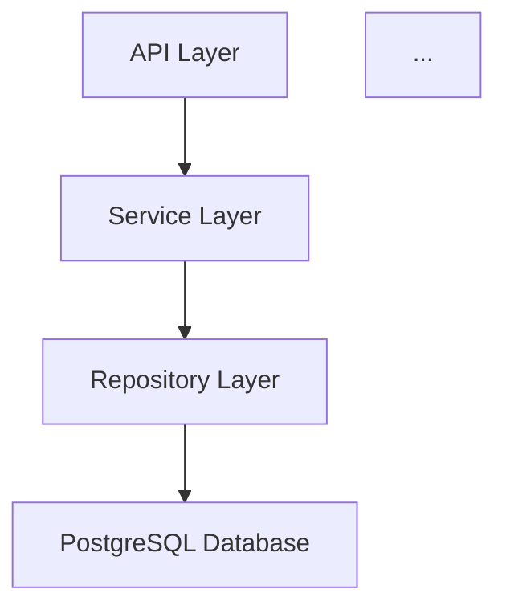

# Deliverables Guide

This guide explains all outputs produced by the AI Codebase Audit System at each stage.

## Overview

The audit system produces **two types of outputs**:

1. **Stage-by-stage artifacts** (in `.analysis/` directory) - Detailed working outputs for transparency
2. **Final executive deliverables** (at repository root) - Polished summaries for decision-makers

## Final Executive Deliverables (Repository Root)

These are the primary outputs you'll reference after the audit completes.

### 1. ANALYSIS-REPORT.md

**Purpose**: Executive summary with top 10 prioritized improvements

**Contents**:
- Executive summary (1 paragraph system health overview)
- Top 10 findings with:
  - Severity and confidence level
  - Exact file:line location (clickable)
  - Evidence from multiple sources (which agents + which tools found it)
  - Code example showing the problem
  - Specific recommendation with fixed code example
  - Effort estimate and impact assessment
  - Adversarial challenge result (was it validated?)
- Analysis methodology summary
- Confidence level breakdown
- Quick wins (not in top 10 but easy fixes)

**Example Entry**:
```markdown
### 1. [Critical] SQL Injection in Payment Processing

**Location**: [src/services/payment.js:156](src/services/payment.js#L156)
**Confidence**: High (converged: security-agent + architecture-agent + sonarqube + eslint)
**Impact**: Allows attackers to execute arbitrary SQL, potentially compromising entire database
**Effort**: Low (2-4 hours)

**Evidence**:
- Security Agent: Unsafe string interpolation in SQL query
- Architecture Agent: Layer violation (controller accessing DB directly)
- SonarQube: Rule SQLI-001 violation
- ESLint: security/detect-unsafe-query

**Example**:
```javascript
// src/services/payment.js:156
const query = `SELECT * FROM payments WHERE user_id = ${userId}`;
```

**Recommendation**:
Use parameterized queries:
```javascript
const query = 'SELECT * FROM payments WHERE user_id = ?';
const results = await db.query(query, [userId]);
```

**Survived Adversarial Challenge**: Yes - Verified as genuine vulnerability with high exploitability
```

**When to Use**:
- Present to leadership for prioritization decisions
- Share with development team for sprint planning
- Include in security review documentation

---

### 2. ARCHITECTURE-OVERVIEW.md

**Purpose**: System architecture documentation with diagrams

**Contents**:
- System purpose and tech stack
- High-level component structure
- Component dependency diagram (Mermaid)
- Data flow diagrams for critical paths
- Design patterns in use
- Deployment model

**Example**:
```markdown
# Architecture Overview

## System Purpose
This is a React SPA with Express backend for e-commerce order processing...

## Tech Stack
- **Frontend**: React 18, Redux, Material-UI
- **Backend**: Node.js 18, Express 4, PostgreSQL 14
- **Key Dependencies**: Stripe API, SendGrid, AWS S3

## Component Diagram

```

**When to Use**:
- Onboard new developers
- Reference during architectural discussions
- Include in technical documentation
- Compare actual vs. intended architecture

---

### 3. FINDINGS-DETAILED.json

**Purpose**: Complete structured data for all findings

**Contents**:
- Metadata (timestamp, repository, tech stack)
- Complete top 10 findings with all details
- All findings from analysis (not just top 10)
- Stage output locations
- Summary statistics

**Structure**:
```json
{
  "analysis_metadata": {
    "timestamp": "2026-02-28T10:30:00Z",
    "repository": "example-app",
    "tech_stack": "javascript",
    "total_findings": 42,
    "confidence_distribution": {
      "high": 15,
      "medium": 18,
      "low": 9
    }
  },
  "top_10": [
    {
      "rank": 1,
      "id": "SQLI-PAYMENT-001",
      "title": "SQL Injection in Payment Processing",
      "severity": "critical",
      "confidence": "high",
      "convergence_score": 0.95,
      "evidence_sources": {
        "agents": ["security", "architecture"],
        "static_tools": ["sonarqube", "eslint"],
        "converged": true
      },
      ...
    }
  ],
  "all_findings": [ /* complete list */ ]
}
```

**When to Use**:
- Import into issue tracking systems (Jira, GitHub Issues)
- Generate custom reports or dashboards
- Programmatic analysis of findings
- Archive for historical comparison

---

### 4. CONFIDENCE-MATRIX.md

**Purpose**: Evidence transparency showing what converged across sources

**Contents**:
- High-confidence findings table (multiple sources)
- Medium-confidence findings (single category)
- Low-confidence findings
- Convergence score explanation

**Example**:
```markdown
# Finding Confidence Matrix

## High-Confidence Findings (Multiple Source Convergence)

| Finding | Agents | Static Tools | Convergence Score |
|---------|--------|--------------|-------------------|
| SQL Injection in Payment | Security, Architecture | SonarQube, ESLint | 95% |
| God Object in PaymentProcessor | Architecture, Maintainability | SonarQube | 60% |

## How to Read This Matrix

- **High confidence**: Multiple independent sources (agents + tools) identified the issue
- **Convergence score**: Statistical measure of agreement (100% = all sources agree)
- **Single-source findings**: Still valid but lower confidence (architectural insights or tool-specific patterns)
```

**When to Use**:
- Justify prioritization decisions to stakeholders
- Understand which findings are most defensible
- Identify findings needing additional human review
- Build trust in automated analysis

---

## Stage-by-Stage Artifacts (.analysis/ Directory)

These provide full transparency into the analysis process. Each stage leaves behind detailed outputs for review.

### Stage 1: .analysis/stage1-artifacts/

**Purpose**: Architecture understanding before analysis

**Files**:
- `architecture-overview.md` - What the system does, components, relationships
- `component-dependency.mermaid` - Module/service dependency graph
- `data-flow-diagrams/*.mermaid` - How data moves through system
- `sequence-diagrams/*.mermaid` - Critical path interactions
- `entity-relationship.mermaid` - Data model overview
- `tech-debt-surface-map.md` - Complexity/age/churn inventory
- `metadata.json` - Stage 1 completion stats

**Evaluation Questions**:
- Does architecture-overview.md correctly describe your system?
- Are all major components shown in component-dependency.mermaid?
- Do data flows match actual system behavior?

**If artifacts are wrong**: Stop and regenerate Stage 1. Incorrect architecture will mislead all subsequent analysis.

---

### Stage 2: .analysis/stage2-parallel-analysis/

**Purpose**: Independent agent findings before synthesis

**Files**:
- `architecture-analysis.json` - Structural and design findings
- `security-analysis.json` - Vulnerability findings
- `maintainability-analysis.json` - Code quality findings
- `dependency-analysis.json` - Supply chain findings
- `convergence-preview.md` - Quick view of multi-agent findings
- `metadata.json` - Agent execution stats

**Evaluation Questions**:
- Did all 4 agents complete successfully?
- Are findings specific (file:line references)?
- What appears in convergence-preview.md (high-signal candidates)?

**Agent Output Schema**:
```json
{
  "agent": "security-analyzer",
  "findings": [
    {
      "id": "SEC-001",
      "title": "SQL Injection in Payment Processing",
      "severity": "critical",
      "category": "injection",
      "locations": ["src/services/payment.js:156-162"],
      "example": { "file": "...", "code": "..." },
      "reasoning": "Why this is significant",
      "recommendation": { "summary": "...", "example": "..." }
    }
  ],
  "metadata": { "total_findings": 18, ... }
}
```

---

### Stage 3: .analysis/stage3-static-analysis/

**Purpose**: Objective tool-based findings

**Files**:
- `unified-results.json` - Standardized cross-tool format
- `raw-outputs/eslint-report.json` - Unmodified ESLint output
- `raw-outputs/npm-audit.json` - Unmodified npm audit output
- `raw-outputs/coverage.json` - Coverage data
- `tool-comparison.md` - What each tool found vs. missed
- `coverage-gaps.md` - Untested critical paths
- `metadata.json` - Tool versions, scan timestamps

**Evaluation Questions**:
- Did all expected tools run successfully?
- Are there any critical vulnerabilities in npm-audit?
- Which files have zero test coverage?

**Unified Results Schema**:
```json
{
  "timestamp": "2026-02-28T11:00:00Z",
  "tech_stack": "javascript",
  "tool_results": {
    "eslint": { "findings_count": 34, "status": "success" },
    "npm_audit": { "findings_count": 5, "status": "success" }
  },
  "findings": [
    {
      "source": "eslint",
      "rule": "security/detect-unsafe-query",
      "severity": "high",
      "location": "src/services/payment.js:156",
      "message": "Unsafe SQL query construction"
    }
  ]
}
```

---

### Stage 4: .analysis/stage4-reconciliation/

**Purpose**: Synthesized findings with convergence analysis

**Files**:
- `reconciled-longlist.json` - Merged findings with confidence scores
- `convergence-analysis.md` - Deep dive on what converged
- `agent-only-findings.md` - Architectural insights no tool caught
- `tool-only-findings.md` - Pattern matches agents missed
- `contradictions.md` - Where agent vs tool disagreed
- `metadata.json` - Reconciliation reasoning stats

**Evaluation Questions**:
- How many high-confidence (convergent) findings?
- Are contradictions.md items resolved correctly?
- Do agent-only findings make sense (architectural insights)?

**Reconciled Finding Schema**:
```json
{
  "id": "RECON-001",
  "title": "SQL Injection in Payment Processing",
  "confidence": "high",
  "convergence_score": 0.95,
  "severity": "critical",
  "evidence": {
    "agents": [
      { "source": "security-analyzer", "finding_id": "SEC-001", "severity": "critical" },
      { "source": "architecture-analyzer", "finding_id": "ARCH-005", "severity": "high" }
    ],
    "static_tools": [
      { "source": "sonarqube", "rule": "sqli-001", "severity": "critical" },
      { "source": "eslint", "rule": "security/detect-unsafe-query", "severity": "error" }
    ],
    "convergence": {
      "agent_count": 2,
      "static_tool_count": 2,
      "total_sources": 4
    }
  },
  "recommendation": { ... }
}
```

---

### Stage 5: .analysis/stage5-adversarial/

**Purpose**: Challenge results to eliminate false positives

**Files**:
- `challenged-findings.json` - Each finding + challenge verdict
- `false-positives-identified.md` - Dismissed findings with reasoning
- `severity-adjustments.md` - Downgraded findings
- `missing-context.md` - What adversarial agent thinks was missed
- `metadata.json` - Challenge process stats

**Evaluation Questions**:
- How many false positives were dismissed?
- Do severity adjustments make sense?
- Were any critical findings downgraded (why)?

**Challenge Verdict Schema**:
```json
{
  "original_finding_id": "RECON-007",
  "original_severity": "critical",
  "challenge_verdict": "DOWNGRADED",
  "challenge_reasoning": "Missing CSRF tokens, but SameSite=Strict cookies provide mitigation",
  "final_severity": "high",
  "code_verification": {
    "location": "src/routes/user.js:89",
    "mitigating_controls_found": true,
    "mitigating_controls": ["SameSite=Strict cookies", "X-Request-ID header validation"]
  }
}
```

---

### Stage 6: .analysis/stage6-final-synthesis/

**Purpose**: Top 10 selection with prioritization reasoning

**Files**:
- `prioritization-matrix.json` - How top 10 were selected
- `top-10-detailed.json` - Complete details for final 10
- `honorable-mentions.md` - Important findings #11-20
- `quick-wins.md` - Low-effort high-impact items not in top 10
- `systemic-patterns.md` - Themes across findings
- `metadata.json` - Final synthesis reasoning

**Evaluation Questions**:
- Does the top 10 match your priorities?
- Are there honorable mentions (#11-20) more important than top 10?
- Are quick wins worth doing first?

**Prioritization Matrix Schema**:
```json
{
  "scoring_criteria": {
    "severity_weight": 0.4,
    "confidence_weight": 0.3,
    "effort_to_value_weight": 0.3
  },
  "all_candidates_ranked": [
    {
      "finding_id": "RECON-001",
      "priority_score": 9.5,
      "severity_score": 4,
      "confidence_score": 3,
      "effort_value_score": 3,
      "rank": 1
    }
  ],
  "top_10_selected": [ ... ]
}
```

---

## Using Stage Outputs for Evaluation

### After Stage 1: Validate Architecture Understanding

**Read**:
- `.analysis/stage1-artifacts/architecture-overview.md`

**Check**:
- [ ] System purpose correctly described
- [ ] Tech stack accurate
- [ ] Major components identified
- [ ] Component diagram matches reality

**If incorrect**: Regenerate Stage 1 with corrections

---

### After Stage 2: Review Independent Findings

**Read**:
- `.analysis/stage2-parallel-analysis/convergence-preview.md`

**Check**:
- [ ] Multiple agents flagged the same issues (high signal)
- [ ] Findings have specific file:line locations
- [ ] Agent reasoning makes sense

**If agents missed obvious issues**: Refine agent prompts

---

### After Stage 3: Verify Tool Execution

**Read**:
- `.analysis/stage3-static-analysis/tool-comparison.md`

**Check**:
- [ ] All expected tools ran successfully
- [ ] No tool failures or errors
- [ ] Unified results contain findings

**If tools failed**: Install missing tools and re-run Stage 3

---

### After Stage 4: Review Convergence

**Read**:
- `.analysis/stage4-reconciliation/convergence-analysis.md`
- `.analysis/stage4-reconciliation/contradictions.md`

**Check**:
- [ ] High-confidence findings have multiple sources
- [ ] Contradictions are resolved sensibly
- [ ] Agent-only findings are architectural insights

**If contradictions unresolved**: Apply human judgment

---

### After Stage 5: Validate Challenge Results

**Read**:
- `.analysis/stage5-adversarial/false-positives-identified.md`

**Check**:
- [ ] Dismissed findings are actually false positives
- [ ] Severity downgrades are justified
- [ ] No critical findings incorrectly dismissed

**If challenges are wrong**: Override adversarial verdict

---

### After Stage 6: Review Final Top 10

**Read**:
- `ANALYSIS-REPORT.md`
- `.analysis/stage6-final-synthesis/prioritization-matrix.json`

**Check**:
- [ ] Top 10 aligns with business priorities
- [ ] Prioritization scores make sense
- [ ] Honorable mentions reviewed

**If prioritization is off**: Adjust weights and re-run Stage 6

---

## Deliverable Checklist

After a full audit completes, verify these files exist:

### Top-Level (Repository Root)
- [ ] ANALYSIS-REPORT.md
- [ ] ARCHITECTURE-OVERVIEW.md
- [ ] FINDINGS-DETAILED.json
- [ ] CONFIDENCE-MATRIX.md

### Stage 1
- [ ] .analysis/stage1-artifacts/architecture-overview.md
- [ ] .analysis/stage1-artifacts/component-dependency.mermaid
- [ ] .analysis/stage1-artifacts/metadata.json

### Stage 2
- [ ] .analysis/stage2-parallel-analysis/architecture-analysis.json
- [ ] .analysis/stage2-parallel-analysis/security-analysis.json
- [ ] .analysis/stage2-parallel-analysis/maintainability-analysis.json
- [ ] .analysis/stage2-parallel-analysis/dependency-analysis.json
- [ ] .analysis/stage2-parallel-analysis/convergence-preview.md

### Stage 3
- [ ] .analysis/stage3-static-analysis/unified-results.json
- [ ] .analysis/stage3-static-analysis/tool-comparison.md

### Stage 4
- [ ] .analysis/stage4-reconciliation/reconciled-longlist.json
- [ ] .analysis/stage4-reconciliation/convergence-analysis.md
- [ ] .analysis/stage4-reconciliation/contradictions.md

### Stage 5
- [ ] .analysis/stage5-adversarial/challenged-findings.json
- [ ] .analysis/stage5-adversarial/false-positives-identified.md

### Stage 6
- [ ] .analysis/stage6-final-synthesis/prioritization-matrix.json
- [ ] .analysis/stage6-final-synthesis/top-10-detailed.json
- [ ] .analysis/stage6-final-synthesis/honorable-mentions.md

---

## Next Steps After Audit

1. **Review ANALYSIS-REPORT.md** - Understand top 10 findings
2. **Check CONFIDENCE-MATRIX.md** - See which findings are most defensible
3. **Read honorable-mentions.md** - Consider findings #11-20
4. **Review quick-wins.md** - Identify low-effort improvements
5. **Create issues** - Import FINDINGS-DETAILED.json into tracking system
6. **Share with team** - Distribute ARCHITECTURE-OVERVIEW.md for reference
7. **Plan sprints** - Prioritize top 10 across upcoming work
8. **Re-audit** - Run again after fixes to measure improvement

---

This deliverables structure provides maximum transparency while still producing clean executive summaries for decision-making.
